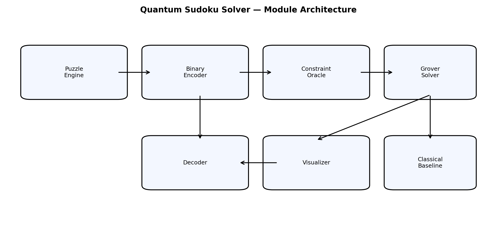
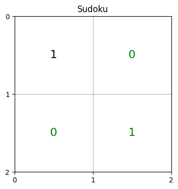
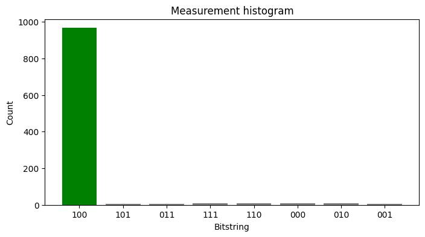
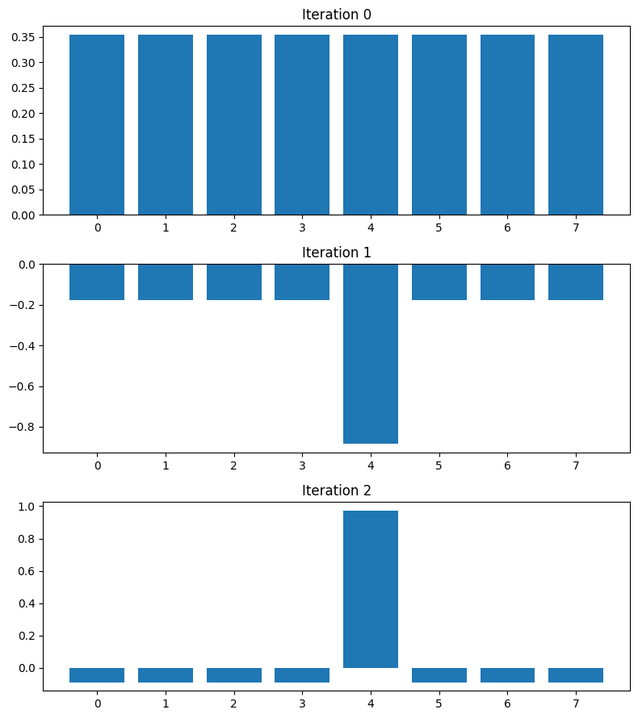
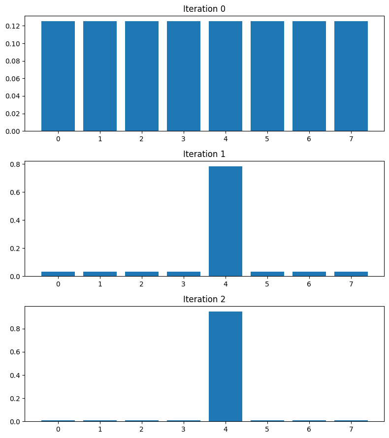
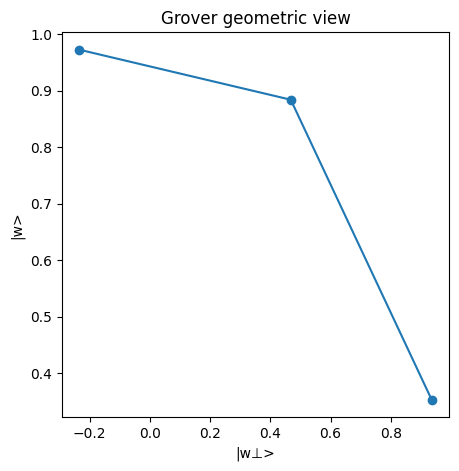
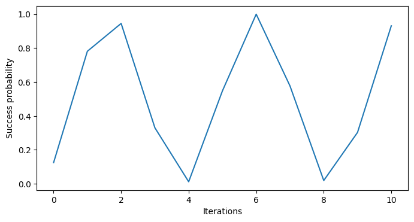
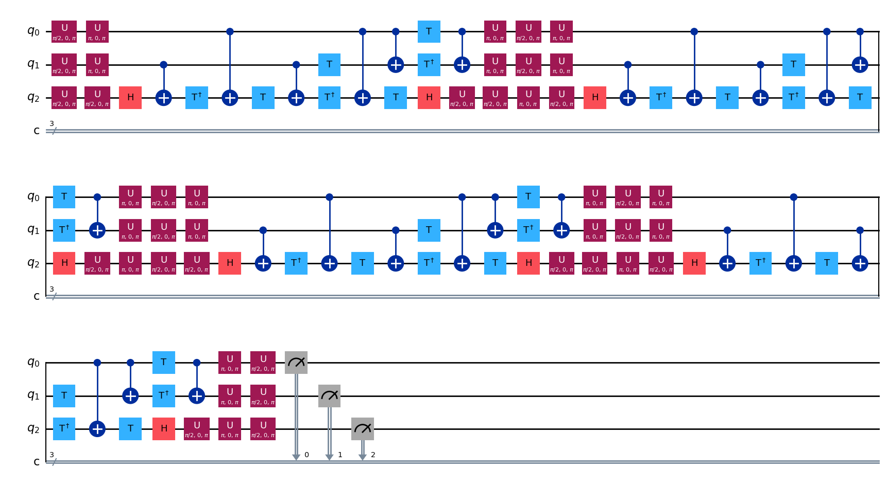
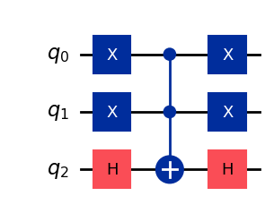
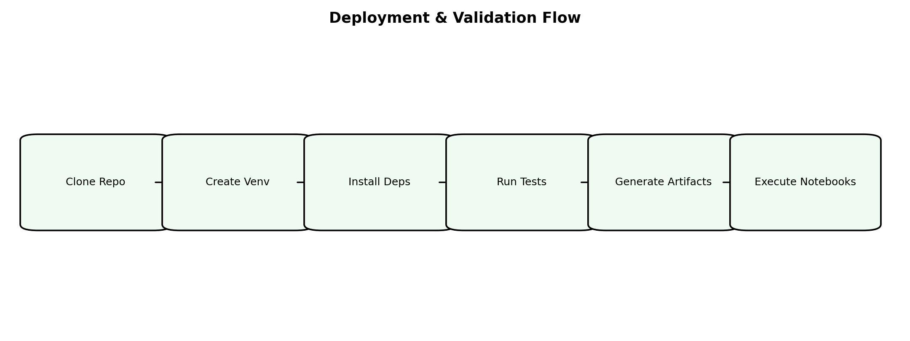

# Quantum Sudoku Solver

Quantum Sudoku Solver is a visually explainable implementation of Grover-style search for toy Sudoku constraint satisfaction in Qiskit.

This project focuses on:
- **2x2 Sudoku** (fully supported, deterministic and lightweight)
- **Reduced 4x4 Sudoku** with small unknown sets (simulation-friendly)

It includes both solver logic and educational artifacts: circuit images, histograms, amplitude/probability evolution plots, and notebook walkthroughs.

---

## 1) Core Features

- Sudoku puzzle engine with parsing, constraints, and solution validation
- Binary encoder for cell-to-qubit mapping with clue-aware handling
- Phase-marking oracle builder for valid Sudoku assignments
- Manual Grover loop: state prep → oracle → diffuser → measurement
- Bitstring decoder with Qiskit bit-order handling
- Classical brute-force comparison + circuit complexity helpers
- Notebook automation for reproducible walkthrough execution

---

## 2) Architecture



Main runtime path:
1. Puzzle input (`SudokuPuzzle`)
2. Unknown-cell encoding (`SudokuEncoder`)
3. Oracle construction (`SudokuOracle`)
4. Grover iterations (`QuantumSudokuSolver`)
5. Decode + verify (`SudokuDecoder`)
6. Visualize + benchmark (`SudokuVisualizer`, classical baseline)

---

## 3) Setup (Local Development)

### Prerequisites
- Linux/macOS/WSL (project tested on Linux)
- Python 3.10+ (3.13 also works in this repo)
- `pip` available in your environment

### Step-by-step

```bash
# 1) Create and activate venv
python3 -m venv .venv
source .venv/bin/activate

# 2) Upgrade tooling
python -m pip install --upgrade pip

# 3) Install dependencies
python -m pip install -r requirements.txt

# 4) Optional but recommended for Qiskit matplotlib circuit drawer
python -m pip install pylatexenc

# 5) Install Jupyter kernel for notebook automation
python -m pip install ipykernel jupyter-client jupyter-core
python -m ipykernel install --user --name quantum-venv --display-name "Python (quantum-venv)"
```

---

## 4) Run Commands

### Solve a puzzle from CLI

```bash
python run_solver.py --puzzle puzzles/2x2/puzzle_002_one_clue.json --shots 1024
```

### Generate core figures/circuits/benchmark CSV

```bash
python run_demo.py
```

### Execute all notebooks headlessly and export executed copies

```bash
python run_all_notebooks.py --kernel quantum-venv --timeout 180
```

### Run tests

```bash
python -m pytest -q
```

---

## 5) Important PNG Outputs

### Solver result views




### Grover dynamics






### Circuit inspection




### Deployment flow



---

## 6) Detailed Deployment Process

This section gives three practical deployment modes.

### A) Local deployment (single machine, recommended)

1. Clone repository to target machine.
2. Create `.venv` and install dependencies (Section 3).
3. Validate environment:
	- `python -m pytest -q`
	- `python run_demo.py`
4. Register notebook kernel and run notebook export:
	- `python run_all_notebooks.py --kernel quantum-venv`
5. Archive or publish generated artifacts from `results/`.

When to use:
- Teaching/demo machine
- Research notebook workflows
- Portfolio showcase

### B) Containerized deployment (reproducible runtime)

Use this if you want exact reproducibility across machines.

1. Build image:

```bash
docker build -t quantum-sudoku:latest .
```

2. Run tests in container:

```bash
docker run --rm quantum-sudoku:latest python -m pytest -q
```

3. Generate artifacts with mounted host volume:

```bash
docker run --rm -v "$PWD/results:/app/results" quantum-sudoku:latest python run_demo.py
```

4. Notebook export inside container:

```bash
docker run --rm -v "$PWD/results:/app/results" quantum-sudoku:latest \
  python run_all_notebooks.py --allow-errors
```

### C) Linux VM service deployment (scheduled runs)

Use this for periodic artifact generation on a remote VM.

1. Provision VM with Python 3.10+.
2. Clone repo and create venv.
3. Add a cron job for nightly artifacts:

```bash
crontab -e
```

Example cron entry:

```cron
0 2 * * * cd /opt/quantum-sudoku && /opt/quantum-sudoku/.venv/bin/python run_demo.py >> /var/log/quantum-sudoku.log 2>&1
```

4. (Optional) add a second cron line for notebook exports.
5. Sync `results/` to object storage or static hosting.

---

## 7) Deployment Checklist

- [ ] Python environment created and activated
- [ ] Dependencies installed (`requirements.txt` + `pylatexenc`)
- [ ] Kernel installed (`quantum-venv`) for notebook automation
- [ ] Tests pass (`pytest -q`)
- [ ] Demo artifacts generated (`run_demo.py`)
- [ ] Executed notebooks exported (`run_all_notebooks.py`)
- [ ] `results/` backed up or published

---

## 8) Project Layout

- `src/` – core solver and analysis modules
- `config/config.yaml` – puzzle and runtime configuration
- `puzzles/` – input puzzle JSONs (2x2 and 4x4)
- `notebooks/` – tutorial and analysis notebooks
- `tests/` – unit/integration tests
- `results/figures/` – generated PNG plots
- `results/circuits/` – generated circuit PNGs
- `results/benchmarks/` – generated benchmark files

